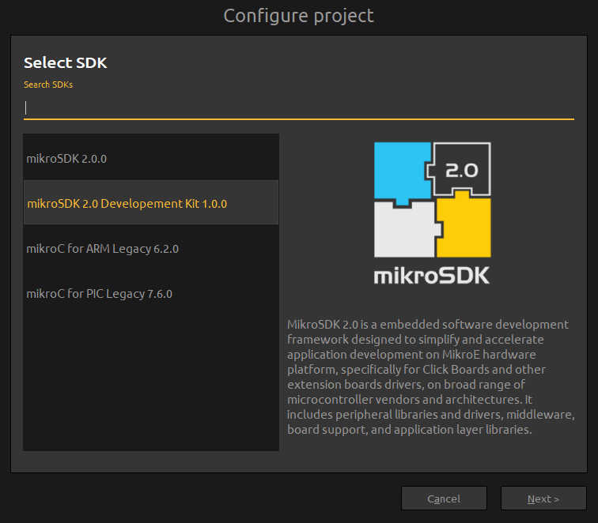

# `mikroSDK 2.0 Development kit`
---

###About

mikroSDK 2.0 Development kit is a Necto Studio package required for mikroSDK 2.0 development.

If you wish to use the whole mikroSDK 2.0 project

###Installation

Simply drag and drop the `mikroSDK 2.0 Development kit.zip` file into Necto Studio and the package will be installed automatically.

###Usage

After successful package installation, follow the steps below:

	1. Open mikroSDK 2.0 project main `memake.txt` file from Necto Studio located one folder above this file.

	2. Select `mikroSDK 2.0 Development kit x.y.z` - where `xyz` represent current version.

	3. Follow the remaining steps to configure the project for your hardware.

---